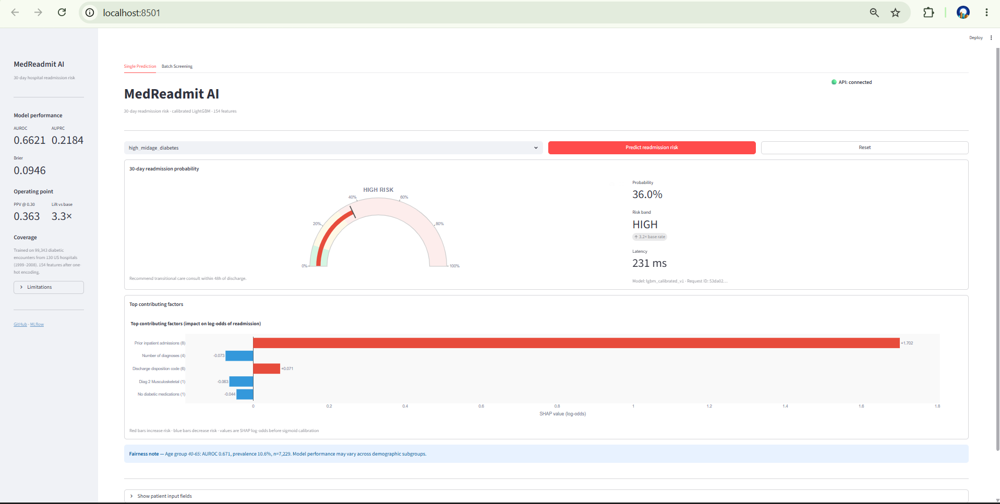
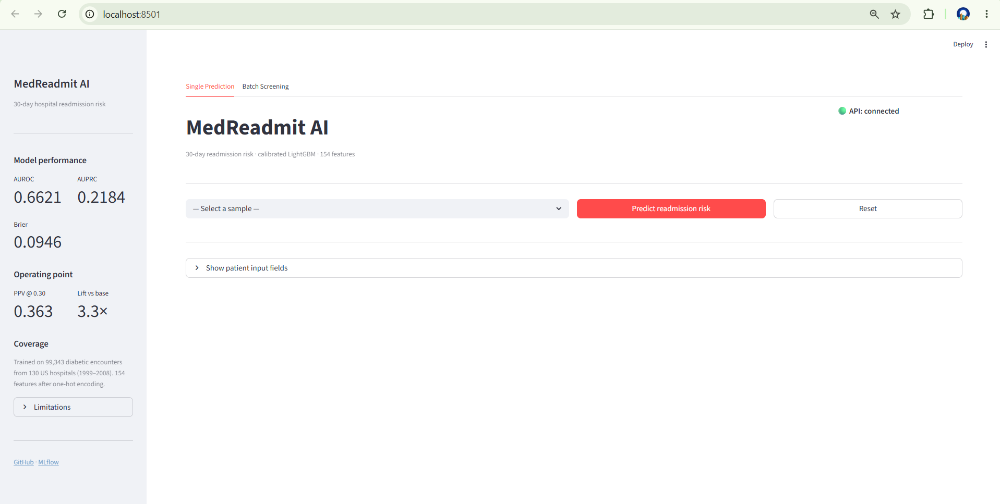
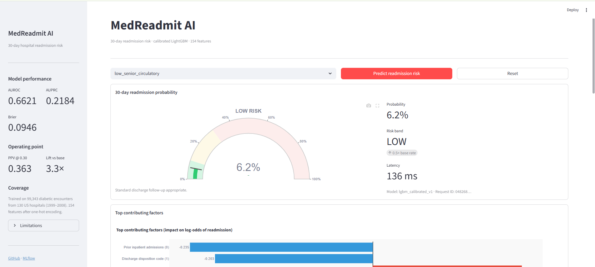
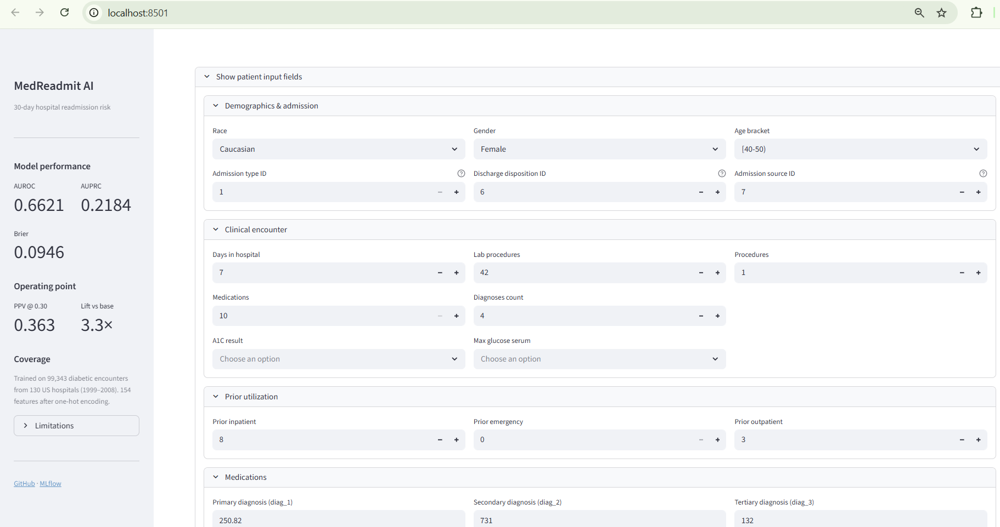
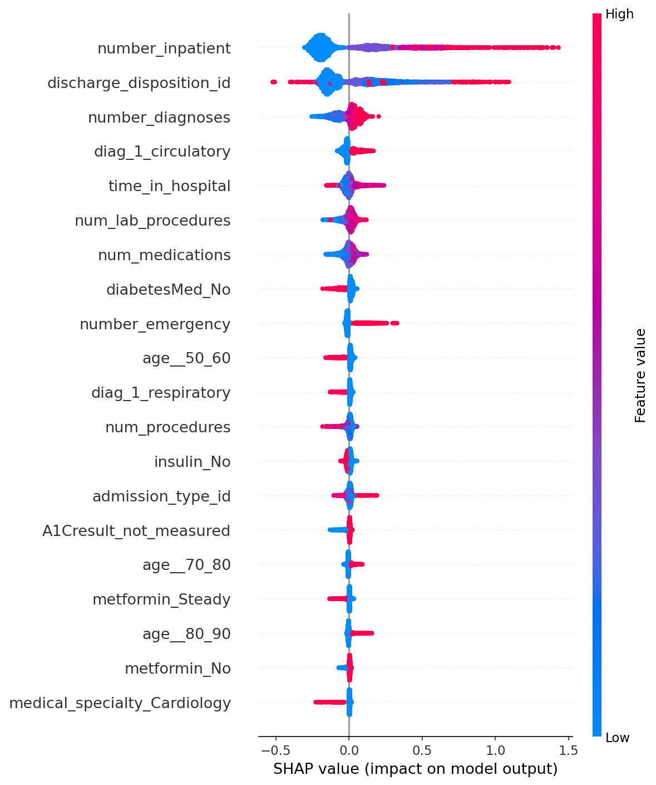
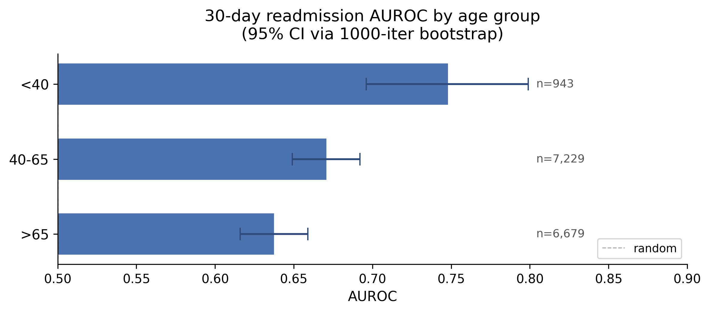

# MedReadmit AI

End-to-end ML system predicting **30-day hospital readmission risk** from structured EHR data.
Calibrated LightGBM · SHAP explainability · demographic fairness audit · FastAPI backend · Streamlit dashboard · Docker.

Built on the UCI Diabetes 130-US Hospitals dataset (101,766 encounters, ~70k unique patients, 1999–2008).

---

## Live dashboard

> If you only have 30 seconds: this is what the deployed system looks like. A clinician selects a patient (or pastes their structured data into the form), clicks predict, and gets a calibrated risk score with SHAP-based explanation and a fairness footnote in under a second.



*High-risk diabetic patient with 8 prior inpatient admissions. The model returns 36% probability (3.2× base rate), classifies as HIGH, and surfaces the top drivers — prior admissions dominates at +1.7 log-odds. Latency 231 ms including SHAP computation. Fairness footnote in blue informs the clinician that AUROC for this patient's age group is 0.671 with prevalence 10.6%.*

---

## Quick start (Docker)

> Requires Docker Desktop ≥ 24 (or Docker Engine ≥ 24 on Linux). Start Docker Desktop before running.

```bash
git clone https://github.com/ubaidur404786/medreadmit-ai.git
cd medreadmit-ai
docker compose -f docker/docker-compose.yml up --build
```

| Service | URL |
|---|---|
| Streamlit dashboard | http://localhost:8501 |
| FastAPI interactive docs | http://localhost:8000/docs |
| FastAPI health check | http://localhost:8000/health |

```powershell
# Windows PowerShell shortcuts
.\make.ps1 up       # build images and start both services
.\make.ps1 down     # stop and remove containers
.\make.ps1 logs     # stream logs from all services
.\make.ps1 rebuild  # force rebuild with no layer cache
```

---

## Architecture

```
┌─────────────────────────────────────────────────────────┐
│  Streamlit frontend  (port 8501)                        │
│  · Risk gauge  · SHAP waterfall  · Fairness footnote    │
│  · Batch screening (CSV / JSON upload)                  │
└───────────────────┬─────────────────────────────────────┘
                    │  HTTP  (docker network)
┌───────────────────▼─────────────────────────────────────┐
│  FastAPI backend  (port 8000)                           │
│  POST /predict        single encounter → probability    │
│  POST /predict/batch  up to 100 encounters              │
│  GET  /health         model metadata + status           │
└───────────────────┬─────────────────────────────────────┘
                    │
┌───────────────────▼─────────────────────────────────────┐
│  LightGBM + Platt scaling  (models/lgbm_calibrated.joblib)  │
│  SHAP TreeExplainer  (built once at startup)            │
│  154 features · 99,343 training encounters              │
└─────────────────────────────────────────────────────────┘
```

**Data flow (training):**
`download` → `load` → `make_target` → `build_features` → `patient_grouped_split` → `train_lgbm` → `tune_lgbm` → `calibrate_lgbm`

---

## Model performance (held-out test set, n = 14,851)

| Model | AUROC | AUPRC | Brier |
|---|---|---|---|
| Logistic Regression baseline | 0.648 | 0.202 | 0.099 |
| LightGBM baseline | 0.662 | 0.218 | 0.223 |
| LightGBM + Optuna (50 trials) | 0.663 | 0.220 | — |
| **LightGBM + Platt scaling** *(production)* | **0.662** | **0.218** | **0.095** |

Hyperparameter tuning recovered minimal additional discrimination — UCI Diabetes has a known AUROC ceiling near 0.69 with structured features alone (Strack 2014; Shang 2021). Platt scaling reduces Brier score by 57% while preserving rank order. The production model's mean predicted probability (0.112) matches the observed base rate (0.111).

**Operating point:** PPV = 0.363 at threshold 0.30 → **3.3× lift** over base rate (0.114).

---

## Visual walkthrough

The four screenshots below show the complete user flow through the deployed Streamlit dashboard. They're included so the project can be evaluated without running Docker.

### 1. Initial state — sidebar model card, demo controls, collapsed input form



The left sidebar serves as a *model card*: production metrics (AUROC, AUPRC, Brier), the operating-point summary (PPV at 0.30 = 0.363, 3.3× lift over base rate), training cohort coverage, and a collapsible "Limitations" block. The top of the page is intentionally sparse — a sample-patient selector and a `Predict` button — so the prediction result is the first major thing a user sees once it runs. The patient input form is collapsed below; clinicians can either load a pre-scored test patient (20 options spanning the risk spectrum) or expand the form to enter a custom encounter.

### 2. High-risk prediction with SHAP attribution


A diabetic mid-age patient with 8 prior inpatient admissions and a primary circulatory diagnosis. The model returns **36.0% probability**, classifies as **HIGH** with the `3.2× base rate` delta indicator inline, and renders an explicit clinical action line ("Recommend transitional care consult within 48h of discharge"). The SHAP horizontal bar chart below shows feature-level contributions in log-odds space — `Prior inpatient admissions (8)` dominates at +1.702, with discharge disposition and a few other features providing smaller pushes. Red bars increase risk, blue bars decrease. Total latency including SHAP: 231 ms. The blue Fairness note at the bottom is generated dynamically from the patient's age group, informing the user of the model's AUROC and base rate for that demographic.

### 3. Low-risk prediction — same UI, different patient



A senior patient with no prior inpatient admissions and a circulatory primary diagnosis. The same UI now shows **6.2% probability**, **LOW** band with `0.5× base rate`, and the clinical action line shifts to "Standard discharge follow-up appropriate." The SHAP chart shows mostly blue bars — features pushing risk *down* (negative log-odds). This screenshot demonstrates that the same UI works coherently across the full risk spectrum and that the clinical action text changes meaningfully with the band, not just the color.

### 4. Patient input form (when expanded)



Expanding the input form reveals four logically grouped sections — **Demographics & admission**, **Clinical encounter**, **Prior utilization**, **Medications** — each laid out in a responsive 3-column grid. Auto-fill happens when a sample patient is loaded; manual entry is also supported for ad-hoc scoring. Fields are validated server-side by Pydantic schemas (`extra="forbid"` catches typos), so an invalid request returns a clean 422 with the offending field rather than reaching the model.

---

## What the model learned (SHAP)

Top 5 features by mean |SHAP| on the test set:

| Rank | Feature | Mean \|SHAP\| |
|---|---|---|
| 1 | Prior inpatient admissions | 0.246 |
| 2 | Discharge disposition code | 0.164 |
| 3 | Number of diagnoses | 0.056 |
| 4 | Primary diagnosis: circulatory | 0.034 |
| 5 | Days in hospital | 0.026 |

Prior admissions dominate — consistent with every major readmission meta-analysis (Kansagara 2011; Donzé 2013).



---

## Fairness audit (age subgroups, 1000-iter bootstrap)

| Age group | n | AUROC | 95% CI | Prevalence |
|---|---|---|---|---|
| < 40 | 943 | 0.748 | [0.696, 0.799] | 11.1% |
| 40–65 | 7,229 | 0.671 | [0.649, 0.692] | 10.6% |
| > 65 | 6,679 | 0.637 | [0.616, 0.659] | 11.7% |



**Key findings:**
- CIs for 40–65 and >65 barely overlap → statistically distinguishable AUROC drop with age.
- The <40 advantage (point estimate 0.748) is not robust — wide CI overlaps 40–65; n=943 is small.
- Calibration is preserved across all groups (mean predicted within 0.005 of observed).
- No detectable disparities by gender or large racial subgroups (Caucasian, AfricanAmerican).
- Smaller subgroups (Hispanic, Asian, Other; n < 300) have CIs too wide for any claim — reported transparently rather than suppressed.

Full audit CSVs: `reports/fairness/`.

---

## API reference

### `POST /predict`
Score a single patient encounter. Returns probability, risk band, top-5 SHAP features, and request ID.

```bash
curl -X POST http://localhost:8000/predict \
  -H "Content-Type: application/json" \
  -d '{
    "race": "Caucasian", "gender": "Female", "age": "[70-80)",
    "admission_type_id": 1, "discharge_disposition_id": 1,
    "admission_source_id": 7, "time_in_hospital": 6,
    "num_lab_procedures": 22, "num_medications": 14,
    "number_diagnoses": 8, "number_inpatient": 2
  }'
```

```json
{
  "probability": 0.213,
  "risk_band": "moderate",
  "model_version": "lgbm_calibrated_v1",
  "request_id": "a3f2...",
  "latency_ms": 62.4,
  "top_features": [
    {"feature": "number_inpatient", "shap_value": 0.41, "feature_value": 2.0}
  ]
}
```

### `POST /predict/batch`
Score 1–100 encounters in a single call. Per-record latency at N=100: **0.87 ms** (vs ~62 ms single-predict) — `pd.get_dummies` alignment runs once on the full batch.

### `GET /health`
```json
{"status": "ok", "model_loaded": true, "n_features": 154, "model_version": "lgbm_calibrated_v1"}
```

---

## Repository layout

```
medreadmit-ai/
├── src/
│   ├── data/           load, target label, patient-grouped split
│   ├── features/       build_features, ICD-9 → 9 clinical groups
│   ├── models/         LightGBM train/tune/calibrate, PlattWrapper
│   ├── evaluate/       AUROC/AUPRC/Brier, fairness audit, bootstrap CIs
│   ├── explain/        SHAP beeswarm / waterfall plots
│   └── api/            FastAPI app, Pydantic schemas, feature alignment, APIExplainer
├── frontend/
│   ├── app.py          Streamlit dashboard (single + batch tabs)
│   ├── components/     risk_gauge.py, shap_chart.py
│   ├── api_client.py   httpx wrapper for the FastAPI backend
│   └── sample_patients/  20 pre-scored test-set patients for the demo
├── docker/
│   ├── Dockerfile.backend   multi-stage, non-root, libgomp1
│   ├── Dockerfile.frontend  slim, Streamlit-only deps
│   └── docker-compose.yml   healthcheck, depends_on
├── models/             trained artifacts (.joblib) + feature_manifest.json
├── scripts/            benchmark, fairness audit, SHAP plots, sample export
├── tests/              49 tests (API, explainer, feature alignment, bootstrap, …)
└── reports/
    ├── fairness/       per-subgroup CSVs with bootstrap CIs
    └── figures/        SHAP beeswarm, waterfall, fairness bar chart, dashboard screenshots
```

---

## Reproducing from scratch

```bash
# 1. Environment
python -m venv .venv && source .venv/bin/activate   # Linux/Mac
# .venv\Scripts\activate                             # Windows
pip install -e .
pip install -r requirements.txt

# 2. Data
python -m src.data.download          # fetch UCI dataset → data/raw/diabetes.csv

# 3. Training pipeline
python -m src.models.train_lgbm      # LightGBM baseline
python -m src.models.tune_lgbm       # Optuna 50-trial search
python -m src.models.calibrate_lgbm  # Platt scaling
python scripts/export_feature_manifest.py  # write models/feature_manifest.json

# 4. Analysis
python scripts/run_shap_analysis.py  # SHAP plots → reports/figures/shap/
python scripts/run_fairness_audit.py # fairness CSVs + bootstrap CIs
python scripts/plot_fairness_age.py  # AUROC-by-age bar chart

# 5. API + frontend (development, no Docker)
uvicorn src.api.main:app --host 127.0.0.1 --port 8000
streamlit run frontend/app.py

# 6. Tests
pytest                               # 49 tests
pytest tests/test_api.py -v          # API endpoint tests (requires uvicorn running)
```

---

## Tech stack

| Layer | Libraries |
|---|---|
| ML | LightGBM · scikit-learn · Optuna · SHAP |
| Data | pandas · NumPy |
| API | FastAPI · Pydantic v2 · uvicorn · httpx |
| Frontend | Streamlit · Plotly |
| Infra | Docker · docker compose |
| Tracking | MLflow |
| Testing | pytest (49 tests) |

Python 3.12 · Ubuntu 24.04 (Docker base: `python:3.12-slim-bookworm`)

---

## Methodology

**Cohort:** Expired/hospice patients (n = 2,423; disposition IDs 11, 13, 14, 19–21) are excluded because they cannot be readmitted — including them would inflate apparent model performance.

**Split:** Patient-level `GroupShuffleSplit` (70/15/15 on `patient_nbr`) prevents the 29% of repeat-encounter patients from leaking between train, val, and test. Row-level splits would report inflated AUROC.

**Features:** Demographics, admission/discharge codes, ICD-9 diagnoses bucketed into 9 clinical categories (circulatory, respiratory, digestive, diabetes, injury, musculoskeletal, genitourinary, neoplasms, other; Strack 2014 scheme), A1C result, max glucose, medication regimen, prior utilization. One-hot encoded → 154 binary/numeric features.

**Imbalance:** `class_weight="balanced"` during LightGBM training. Post-hoc Platt scaling on the validation set restores calibrated probabilities without retraining.

**Feature alignment:** A `feature_manifest.json` frozen at training time is the contract between the training pipeline and the inference API. At inference, `align_to_training_schema` reindexes to the 154 training columns (fills missing with 0, drops unseen extras). Batch alignment runs `pd.get_dummies` once on all N rows — critical for the 65× per-record speedup at N=100.

**SHAP:** `APIExplainer` wraps the underlying `LGBMClassifier` (not the `PlattWrapper`) because `shap.TreeExplainer` requires a tree-native object. Values are in log-odds space (pre-Platt); Platt scaling preserves feature rank order so the attribution remains valid for the calibrated model.